# VetPet Assistant - Student Project

**VetPet** is a web application designed to facilitate research and provide information about pet health and care. It offers users an intuitive chat experience with the virtual assistant **VetPet ChatBot**. This application addresses the need for quick, accurate, and professional answers to questions related to pet health and well-being. Users can access information about nutrition, health, average lifespan, habitat, and behavior of various pet species in one place.

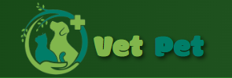

The application utilizes **Wit.ai** technology for natural language processing, allowing VetPet ChatBot to recognize user queries and provide personalized responses. Additionally, users can access fun and educational facts about dogs, thanks to the integration with **Dog API**, which generates random dog facts. This way, VetPet not only delivers useful information but also enhances the user experience through interactivity and entertainment.

For visual representation, the application integrates **Unsplash API**, enabling the display of images related to specific animal species or breeds. This contributes to a better understanding and visualization of the information users are searching for.

### **Admin Dashboard**
Administrators play a key role in maintaining the system. Their **dashboard** provides:
- User management
- Data and statistics overview (including the number of interactions and user details)
- The ability to edit user profiles
- The option to delete inappropriate messages
- Real-time monitoring of application statistics to ensure high-quality service

### **Technology Stack**
VetPet Assistant is built using the **MERN stack** (MongoDB, Express, React, Node.js) with an **MVC architecture**. It solves the challenge of **accessible pet health information**, enabling users to obtain accurate data quickly and easily. Meanwhile, **administrators** have a **comprehensive overview** of application data and user interactions, making the system **reliable and scalable**.

---

## **Installation Guide**
1. **Clone the repository:**
   ```bash
   git clone https://github.com/Ksenijacv/Veterinarian-AI-Assistant.git
2. **Install dependencies:**
    ```bash
    npm install
3. **Go into the server directory:**
    ```bash
    cd projekat
    cd server
    npm start
4. **Go into the client directory:**
    ```bash
    cd projekat
    cd server
    npm start
5. **Run the app within desired browser and enjoy the unique user experience!**

# System Architecture Overview

The **VetPet Assistant** is a full-stack web application built on the **MERN stack (MongoDB, Express.js, React, Node.js)**. The architecture consists of multiple interconnected components:

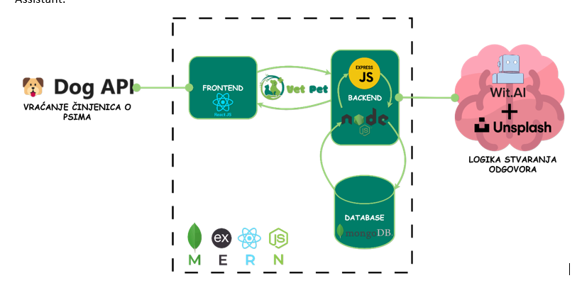

- **Frontend (React.js):** Handles user interactions and displays data.
- **Backend (Node.js & Express.js):** Manages business logic, handles API requests, and communicates with the database.
- **Database (MongoDB):** Stores user profiles, pet-related data, and chatbot interactions.
- **Third-party APIs:**
  - **Wit.ai:** Processes natural language input and generates chatbot responses.
  - **Unsplash API:** Retrieves images related to pet breeds and species.
  - **Dog API:** Fetches random dog-related facts to provide an interactive experience.

This structure ensures a **responsive, scalable, and interactive user experience**.

---

# Software Development Lifecycle Diagram

This image illustrates the **simplified Larman methodology** used in the development of the **VetPet Assistant**. The software development lifecycle (SDLC) includes the following phases:

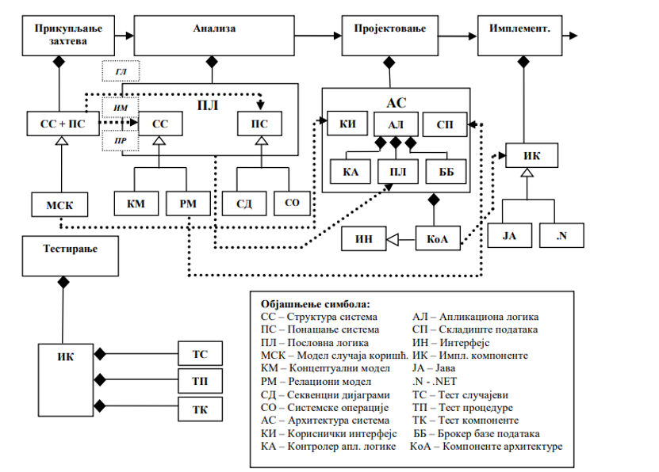

1. **Requirements Gathering:** Understanding user needs and defining key features.
2. **Analysis:** Identifying system components, user interactions, and business logic.
3. **Design:** Creating software architecture, UI/UX elements, and database structures.
4. **Implementation:** Writing code for the frontend, backend, and API integration.
5. **Testing:** Performing unit, security, and functional tests to ensure system stability.
6. **Deployment & Maintenance:** Launching the application and continuously improving based on user feedback.

Each phase is interconnected, ensuring **iterative development** with a structured approach.

---

# Entity-Relationship (ER) Model for Database

The **VetPet Assistant** database follows a **document-oriented NoSQL structure**, utilizing **MongoDB**. The main entities and their relationships include:

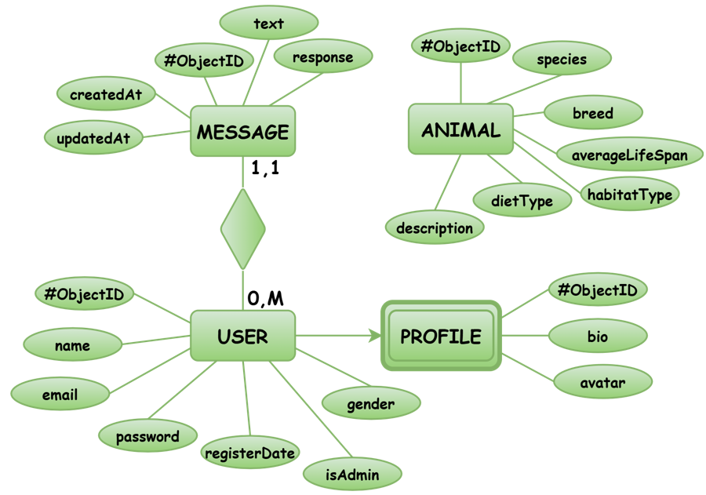

- **USER:** Stores personal information such as name, email, password, and admin status.
- **PROFILE:** A detailed extension of the user entity, including bio, avatar, and gender.
- **ANIMAL:** Stores information about pet species, breed, diet, lifespan, and habitat.
- **MESSAGE:** Represents chatbot interactions, linking user messages with bot responses.

This schema ensures **efficient data retrieval** and enables easy scalability for handling **large datasets**.

# **VetPet Assistant - UI Design (External Forms)**

### **Homepage**
The **VetPet** application homepage is designed to attract users with a **clear and intuitive layout**. On the **left side** of the screen, the application's name and a **brief description** of its functionality are displayed. On the **right side**, a **visual slider** is integrated, which automatically changes, displaying images related to **veterinary practice** and **animal care**. 

At the **top navigation menu**, there are buttons for accessing the **"About Us"** page and a **Sign-in** option, allowing easy navigation to other **key sections** of the application.

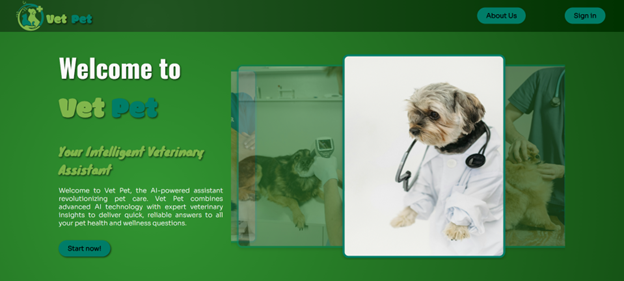

---

### **About Us Page**
This page provides **detailed information** about **VetPet**. At the top, an **animated GIF of animals** is featured, adding a **dynamic element** to the design. Below the **GIF animation**, the **title "About Us"** is prominently displayed, followed by a description explaining the **purpose** of the application and how it utilizes **artificial intelligence** to provide information about pet health.

The design is **simple yet visually engaging**, focusing on **visual elements** and informative content.

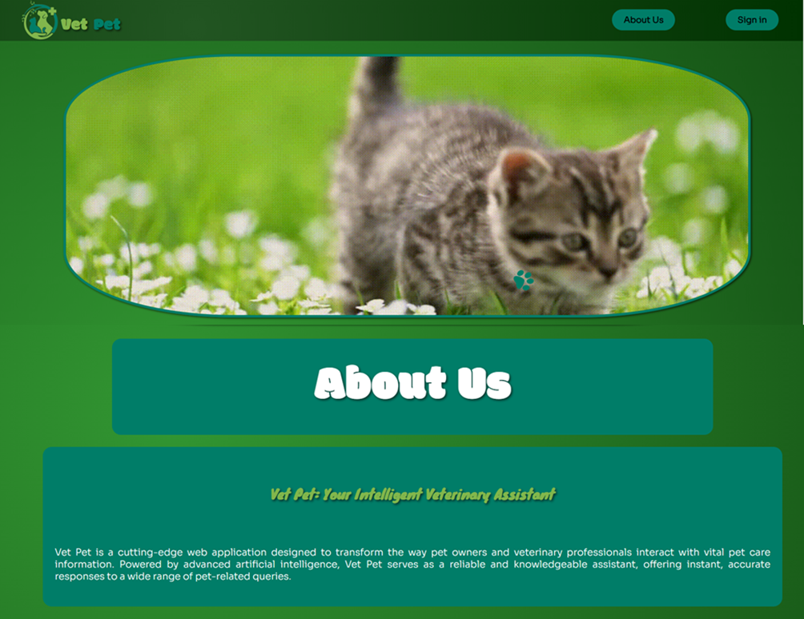

---

### **User Registration Page**
The **registration page** allows users to **create an account** by entering:
- **Email address**
- **Name**
- **Password**
- **Gender**
- **Biography**
- **Avatar URL**

The **user interface** is **minimalistic**, with **clearly labeled fields** and a **"Register"** button to confirm the registration. 

At the **bottom of the page**, there is an option for users who already have an account to **sign in** via a **"Sign in"** link. An additional **visual element** is a **robotic dog**, symbolizing the **technological aspect** of the **VetPet** application.

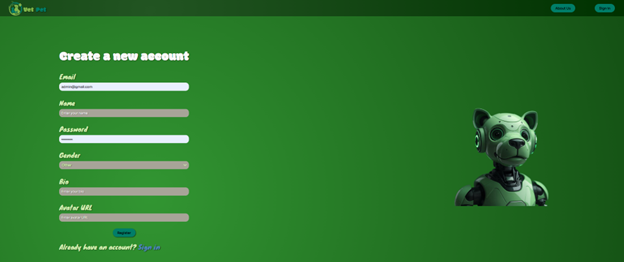

---

### **User Login Page**
This page allows **registered users** to log in by entering their **email address** and **password**. The design is **similar** to the **registration page**, featuring **clearly defined fields** and a **"Log in"** button for confirmation. 

Users who do not have an account can click on the **"Sign up"** option, which redirects them to the **registration form**. On the **right side** of the screen, an image of a **robotic dog** is displayed, maintaining the **visual consistency** of the application.

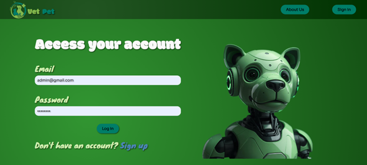

---

### **User Profile Page**
After **successful login**, users can access their **profile**, which displays:
- **Name**
- **Email**
- **Gender**
- **Biography**

At the **top of the page**, the **user's avatar** is displayed, followed by an **"Edit Profile Info"** button, allowing users to **update their information**. 

The **navigation menu** includes options for:
- **Viewing the profile**
- **Logging out**
- **Navigating to the "About Us" page**

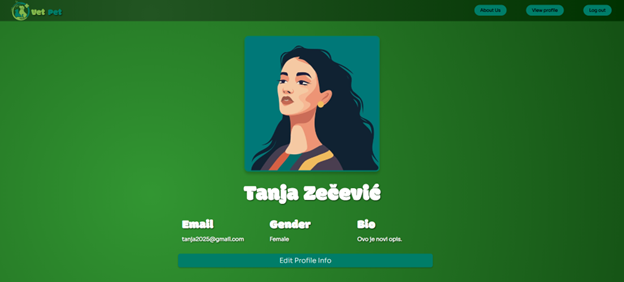

---

### **Chatbot Interaction Page**
This page allows users to interact with the **AI chatbot**, which provides **information about pets**. The **chat interface** is **simple and user-friendly**, displaying:
- **User queries**
- **AI responses** 

Messages are displayed in **different colors** to improve **readability**. At the **bottom of the screen**, there is a field to **enter new messages**, along with a **"Send"** button to submit queries to the AI assistant.

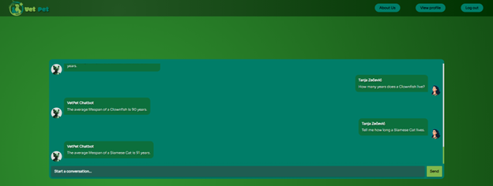

---

### **Administrator Dashboard**
When an **administrator logs in**, instead of the **regular homepage**, they see a **special interface** with:
- A **welcome message**
- **Options for managing users**
- **Statistical data overview**

On the **right side** of the screen, a **robotic dog** is displayed, while on the **left side**, there is a **"Manage Users"** button that redirects to a page containing a **list of users**.

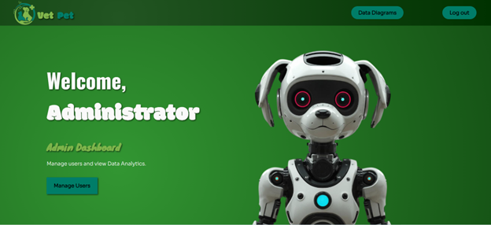

---

### **User Management Page (Admin)**
This page allows the **administrator** to:
- **View a list of users**
- **Search users by name**
- **Sort users by the number of messages sent**
- **Filter users by gender**

Additionally, the **administrator** can:
- **Export user data in CSV format**
- Use the **"Edit"** and **"Delete"** options to **modify** or **remove users**.

The design is **optimized for managing large user bases**.

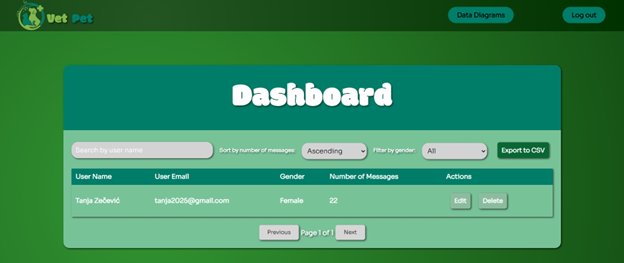

---

### **Statistics & Analytics Page (Admin)**
This page provides **administrators** with an overview of **statistical data** through **interactive diagrams**. The displayed graphs include:
- **Animal habitat distribution**
- **Message distribution analytics**
- **Number of breeds per species**

At the **bottom of the page**, a **random Dog Fact** is displayed, offering **interesting insights about dogs**, increasing **user engagement**.

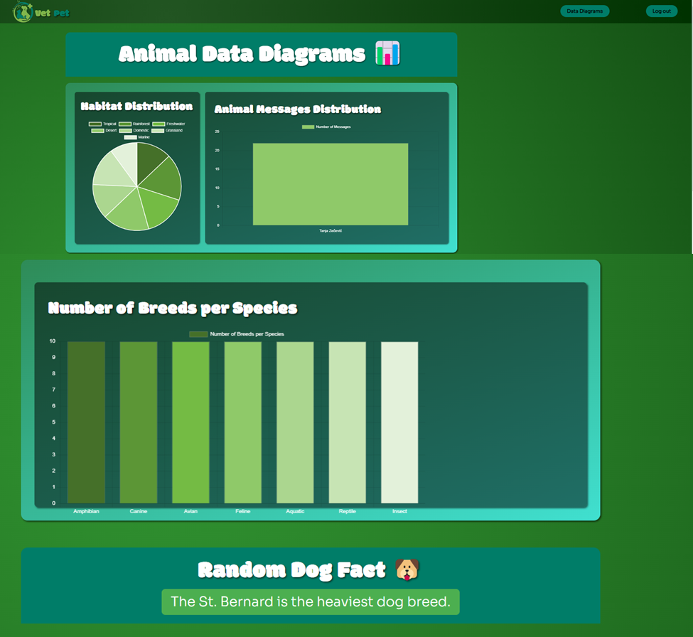

